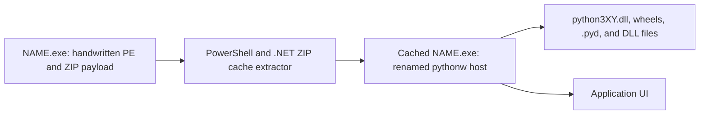

# python-to-binary detailed guide

`python-to-binary` (`py2bin`) is a standard-library-only toolchain with six
separate jobs:

1. Prove that a closed application has no CPython/fallback requirement and
   either build an attested direct-native artifact or write no artifact.
2. Translate a supported Python subset into portable C source.
3. Compile C -- the integer and pointer language, with the whole integer type
   zoo, real memory, casts, `sizeof`, and the full statement set -- into
   machine code using no external C compiler, assembler, or linker.
4. Translate a smaller static Python subset directly into ELF, PE, or Mach-O
   machine-code files without an assembler or linker.
5. Compile canonical C that calls a vetted set of CPython C-API entry points,
   producing a `darwin-arm64` binary that dyld-links the interpreter — the
   program's logic becomes machine code while object semantics stay in
   libpython.
6. Bundle full CPython applications, package data, native extensions, and an
   optional embedded interpreter when source-level native compilation is not
   compatible with the program.

These modes are intentionally distinct. A dynamic application importing Manim,
PyTorch, Transformers, Blender `bpy`, or pywebview cannot truthfully be
converted into one architecture-independent native executable merely by
rewriting its Python files.

### Three tiers, and which one you are actually using

Jobs 1–6 collapse into three guarantees. Pick by the middle column.

| Tier | What runs your logic | CPython present? | Accepts arbitrary Python? | Standalone artifact? |
|---|---|---|---|---|
| (a) `freeze` / `bundle` — PyInstaller-shaped | CPython, interpreting your code | yes, bundled | yes, in practice | yes |
| (b) C-API path — Nuitka-shaped | machine code py2bin wrote | yes, linked externally | no, small explicit subset | **no** |
| (c) `compile` — direct native | machine code py2bin wrote | no | no, small explicit subset | yes |

Tier (b) is Nuitka's shape with Nuitka's dependency removed: Nuitka hands its
generated C to gcc, and py2bin compiles the C with its own parser and encoder.
The honest cost is that py2bin does not *generate* the C-API calls from
ordinary Python — the programmer writes them. See
[The CPython C-API tier](#the-cpython-c-api-tier). None of the three tiers
invokes gcc, clang, `as`, `ld`, Xcode, or an SDK; py2bin does not import
`subprocess` and never starts a process, and the test suite fails if that
changes.

## Installation

From PyPI:

```sh
python3 -m pip install python-to-binary
```

Directly from GitHub:

```sh
python3 -m pip install \
  "git+https://github.com/yu314-coder/python_to_binary.git"
```

From a clone without installing:

```sh
git clone https://github.com/yu314-coder/python_to_binary.git
cd python_to_binary
PYTHONPATH=src python3 -m py2bin --help
```

Python 3.10 or newer is required on the build host. Native compilation itself
does not invoke a C compiler, assembler, linker, target SDK, Docker, or target
Python runtime.

The py2bin package has empty build and runtime dependency lists and imports
only Python standard-library modules. It does not use Cython, Nuitka, mypyc,
Rust, C, C++, PyInstaller, or PPCI. This statement describes py2bin itself,
not third-party payloads: a bundled `bpy`, Torch, or NumPy wheel contains that
project's own native implementation and still runs through embedded CPython.

## Choosing an output strategy

| Program | Recommended command | Target Python required |
|---|---|---:|
| Closed program that must never fall back to CPython | `aot-plan`, then `aot-build` | No |
| Static constants, printing, integer exit | `compile` | No |
| C in py2bin's integer, floating-point and pointer language | `compile-c` | No |
| C, or `py2bin.cabi` Python, calling the vetted CPython C-API | `compile-c` or `compile`, `--target darwin-arm64` | Yes — the artifact dyld-links the build host's CPython |
| Supported integer Python with an inspectable C intermediate | `compile-via-c` | No |
| Supported typed Python subset | `emit-c` | C source only |
| Ordinary pure-Python project | `build` or `freeze` | `build`: yes; `freeze`: no |
| pywebview/Manim/Torch/Transformers/bpy | `freeze` | No, but native libraries remain target-specific |

`freeze` and compatible `assemble` builds are self-extracting one-file outputs
by default. Use `--onedir` only when an inspectable runtime directory is more
useful than one-file distribution.

For the strongest no-fallback contract, use:

```sh
py2bin aot-plan app/main.py --source-root app --json --strict

py2bin aot-build app/main.py --source-root app \
  --via-c --c-output dist/App.c \
  --target windows-x86_64 --output dist/App.exe \
  --attestation dist/App.aot.json --clean
```

The plan walks local imports without executing them. It rejects unresolved or
unported libraries, unsupported compiler semantics, and dynamic `eval`,
`exec`, runtime `compile`, `__import__`, and `importlib.import_module`. The
build has no compatible backend: failure leaves no executable. After native
emission it rejects Python files, Python bytecode, CPython library paths, and
known self-extraction/bootstrap markers, then records a raw artifact SHA-256.

`--via-c` makes the complete accepted program take this stricter route:

```text
entry plus supported local Python modules
  -> optimized py2bin IR
  -> deterministic whole-program canonical C
  -> py2bin's handwritten IR-C parser
  -> exact IR equality check
  -> handwritten PE/ELF/Mach-O writer
```

This differs from the older single-file `compile-via-c` command. Local
functions have already been semantically checked and inlined when the
whole-program C is emitted, so accepted library code participates in the same
C round trip. The C uses explicit signed-integer slots, labels, `goto`,
conditional branches, `fwrite`, and returns. It is retained for inspection
when `--c-output` is supplied, but is never given to an external C compiler.
The attestation records `python-ir-c-ir-machine` as the pipeline.

This is an enforcement mechanism, not a claim that arbitrary Python is already
supported. See the
[CPython-free whole-application architecture](NATIVE_AOT_ARCHITECTURE.md) for
the object-runtime, standard-library, linker, and per-library work still
required.

Use `plan-c` before assuming C translation is safe:

```sh
py2bin plan-c app.py
```

It returns `c-source` for the implemented C subset and `cpython-bundle` when
imports or unsupported Python semantics require compatibility mode.

Use `capabilities` for the stricter machine-code question:

```sh
# Stable claim matrix for common packages.
py2bin capabilities

# Inspect imports and the first native-subset rejection without executing code.
py2bin capabilities app.py
py2bin capabilities app.py --json

# Suitable for a check that must fail when compile cannot be used.
py2bin capabilities app.py --strict
```

The default catalog reports `native AOT: no` for NumPy, SciPy, pandas, scikit-learn,
Torch, TorchVision, TensorFlow, JAX, Transformers, Tokenizers, Manim,
Matplotlib, Pillow, OpenCV, `bpy`, pywebview, Gradio, Streamlit, Numba,
llvmlite, Requests, Flask, Django, and FastAPI. This is not a packaging
allowlist. It is a claim matrix explaining that these projects are not
translated by the current `compile` frontend. Their `freeze` status is
conditional on compatible CPython, target wheels/native files, package data,
external tools, drivers, and system services as applicable.
NumPy and Torch imports are rejected by `compile`; py2bin does not reimplement
a third-party numerical library, because an integer reimplementation would not
match the real package's runtime object semantics (a reduction is `np.int64` /
a 0-d tensor, not a plain `int`). They are available only through `freeze`.

### Exact direct-native subset

The current native frontend combines static output with a small integer
runtime:

- literals, one-name assignments, and constant Boolean/conditional expressions
  are accepted;
- an f-string is built at run time when its fields are: each field is rendered
  the way `str()` would render it and concatenated on the spot - on the spot
  because float rendering hands back scratch the next float would overwrite.
  A field may carry a literal format specifier
  `[[fill]align][sign][0][width][,][.precision][type]` with `type` one of `d`,
  `f`, `s` or omitted: `{x:>8}`, `{x:*^11}`, `{n:05d}`, `{n:+,d}`, `{v:8.3f}`.
  Fixed point rounds the exact binary value half to even, as CPython does, so
  `f"{2.675:.2f}"` is `2.67`. `!r`, `!s`, and `!a` are accepted on numbers,
  where all three are `str()`; on a string only `!s` is, because `!r` would
  have to reproduce Python's quoting and escaping. Everything else - `e`, `g`,
  `n`, `%`, `b`, `o`, `x`, `#`, `z`, `_`, a precision on a string, a separator
  next to zero padding, and a specifier that is itself an expression - is
  rejected at build time with a message naming what is supported;
- a runtime list grows. Its block is `[capacity][length][elements]`, and
  `xs.append(v)` writes at the length and moves on; when the capacity is
  reached the list is copied into a block of twice the size, because the arena
  hands out addresses in order and the block cannot be extended where it
  stands. The abandoned block stays in the arena, which never reclaims, so
  appending is amortised rather than free. `[]` is a list, and `xs: list[float]
  = []` is a float one;
- `x in xs` / `not in` over a runtime list (comparing floats as floats, so
  `0.0` finds `-0.0` and a NaN finds nothing), and `sub in s` over a runtime
  string, which scans forward from every byte - safe without decoding, because
  a UTF-8 lead byte and a continuation byte come from disjoint ranges and
  cannot match each other;
- a native function may take a runtime string and return one. A string is its
  block pointer, so the value crosses like any integer; what the call has to
  carry alongside it is the kind, because a pointer and a number are the same
  thing once they are only a value. Its *numeric* parameters cross the same
  way, which is what lets `def tag(n): return f"n{n}"` render one. A bool
  argument keeps its identity across the call - nothing at run time tells a
  bool from an integer, so which one was passed is read from the source at the
  call site and carried in, and without that `f"{flag}"` wrote `1`. A parameter
  shadows an outer name of its own spelling, so a folded constant for that name
  is dropped on the way in;
- a string may also be returned from a body with branches, a loop, or a method.
  The result of an inlined call lives in one slot, so the call site has to know
  before the body is inlined whether it is holding an address or a number. It
  reads the body to find out: parameters get stand-ins of the right kind,
  locals are typed by a walk over the assignments in source order, and every
  return has to agree. A body that answers a string on one path and a number on
  another is refused, because one slot cannot be both;
- `==` and `!=` between runtime strings, comparing length then bytes: the same
  comparison a string-keyed dict already makes when it probes. `<`, `<=`, `>`
  and `>=` walk the bytes, which is also a walk over code points - UTF-8 was
  built so that ordering two sequences by their bytes gives the same answer as
  ordering them by their code points, which is what CPython compares, so
  nothing has to be decoded. The bytes are read unsigned; read as signed, a
  lead byte is negative and `"é"` would sort before `"z"`. Where one string is
  a prefix of the other the lengths decide. A chain (`"0" <= ch <= "9"`) lowers
  each operand once and ands the comparisons;
- `s[i]` is the one-code-point string at that position. Indexing is not slicing
  with a narrower window: a slice clamps, so `s[99:100]` is `""`, while `s[99]`
  raises `IndexError`, and the bound is checked against the code-point count
  because that is what Python indexes by. `for ch in s` walks the same way. A
  string never moves and never changes length, so its block and count are read
  once - unlike a list, whose length is re-read every step because an append
  inside the loop extends the walk;
- `ord(s)` and `chr(n)`. The decoder branches on the lead byte rather than
  reading four bytes and masking, because a one-byte code point at the end of a
  string has no second byte and the block is only as long as its contents.
  Nothing validates the encoding, which is sound for a narrow reason: every
  string here was written by the compiler from source text or built by joining
  ones that were. `chr()` of a lone surrogate is refused - CPython hands one
  back and fails later, when it is written out, and a native string is its
  UTF-8 bytes with nowhere to keep one;
- string methods on any runtime string expression: `.startswith()`,
  `.endswith()`, `.find()`, `.index()`, `.count()`, `.replace()`, `.strip()`,
  `.lstrip()`, `.rstrip()`, `.zfill()`, `.center()`, `.ljust()`, `.rjust()`,
  `.upper()`, `.lower()`, `.capitalize()`, `.title()`, `.isdigit()`,
  `.isalpha()`, `.split()` and `.join()`. `.split()` with no argument splits on
  runs of the same 29 Unicode whitespace code points `.strip()` uses and drops
  every empty piece; `.split(sep)` keeps them, so `",a,".split(",")` is three
  pieces and `"".split(",")` is one. An empty separator raises a catchable
  `ValueError` at run time, and is refused at build time when it is already
  known to be empty. `.join()` measures the pieces in one pass and allocates
  once, because a concatenation per element would be quadratic in an arena that
  never reclaims. The searches share one scan, and they only start at code-point
  boundaries so that an empty needle is found between characters rather than
  between the bytes of one - which is what makes `"é".count("")` two.
  `.find()` reports a character index, not a byte offset, and widths count
  characters. `.strip()` removes all 29 Unicode whitespace code points, not the
  ASCII five. `.replace()` counts first and allocates once, because a
  concatenation per occurrence would allocate inside a loop.
  The six case and character-class methods are the honest exception: they are
  Unicode mappings - `'ß'.upper()` is the *two* characters `'SS'` - and the
  tables are not in the image, so a receiver that is not ASCII stops the
  program with a named message on stderr and exit 1 rather than returning a
  byte-flipped answer. A non-ASCII constant receiver is rejected at build time
  instead. Because that check can stop the program, those methods and
  `.index()` are refused inside a conditional expression or a short-circuited
  Boolean operand, where both arms are lowered eagerly;
- a container is true when it is not empty, so `if xs:`, `while queue:`,
  `not s` and `bool(d)` all work, and so does a runtime float, which is true
  when it is not zero. This used to be refused, and for a good reason: a
  container's slot holds the address of its block, that address is never zero,
  and reading it as a number made an empty list true. The count answers it
  properly. `and` and `or` work in a condition, where the question is each
  operand's truth; the value form is still refused, because `xs and ys` answers
  with one of the two and one slot cannot hold either kind. An instance is
  always true, which is said outright rather than left to fall out of its
  address being non-zero;
- `for index, item in enumerate(xs)` and `enumerate(xs, start)`, and
  `for a, b in zip(xs, ys)` over any number of lists. Each list's length is
  read from its own header at every step, so the walk stops with the shortest
  and an append inside the body lengthens it, both as CPython's does;
- `xs.pop()`, `xs.pop(i)`, `xs.insert(i, v)`, `xs.remove(v)`, `xs.index(v)` and
  `xs.count(v)`. pop() answers the element word and closes the gap; insert()
  appends and then rotates the tail up, because append is the only path that
  knows how to grow a block and write the moved address back, and it clamps its
  index the way CPython's does rather than raising. remove() and index() share
  one scan that stops at the first match, comparing floats as numbers rather
  than as their bits so that `-0.0` finds `0.0`. The wording of the exceptions
  is CPython's: "pop from empty list", "pop index out of range",
  "list.remove(x): x not in list", "list.index(x): x not in list";
- `d.get(k, default)`. The default is required: the one-argument form answers
  `None` when the key is absent, and there is no `None` here to answer with;
- `round(x)`, with ties going to the even number as Python's does, so
  `round(2.5)` is 2 and `round(3.5)` is 4. The fraction is the value minus its
  floor, which is exact for every double. `round(x, n)` is refused - it rounds
  in decimal and answers a float rather than an int;
- `q, r = divmod(a, b)`, and nothing else: divmod() answers a tuple, and a
  tuple here is a block built from a literal, so the general form would
  allocate a pair that is always taken apart on the next line. Each operand is
  bound to a hidden name first, so a side-effecting one runs once and not once
  per half;
- a name bound on only some of the paths reaching a point is refused where it
  is read. CPython raises `NameError` there; there is no run-time bit recording
  whether a slot was written, so the alternative is reading whatever preceded
  it - a stale folded constant for an integer, and for anything on the heap an
  address that is not a block. An arm that leaves by `raise` or `return` does
  not count against this, and an `elif` chain that binds the name everywhere is
  accepted. A `def` under a run-time condition is refused for the same reason
  in reverse: a call is inlined from one body chosen at build time, so the
  branch that ran could not decide which body that is;
- `global` inside a native function names the module's variable rather than a
  local. Such a name is kept in a slot rather than folded, because inlining
  swaps the build-time constant map and a constant written inside the body
  would be dropped when the module's map came back;
- `sum()`, `min()`, `max()`, `any()` and `all()` over a runtime integer list or
  over a generator expression, and `abs()`. `sum(xs, start)` adds the start to
  the walk - integers only, because the walk adds integers and a float start
  would make the result a float after the fact. `min()` and `max()` of an empty
  iterable raise a catchable `ValueError`, as CPython does; `any()` of an empty
  one is `False` and `all()` of it is `True`;
- `sorted(xs)`, `xs.sort()` and `for v in reversed(xs)` over a runtime list of
  integers, floats or strings, with `reverse=True` accepted when it is a
  constant. Strings are compared through the text they point at rather than by
  their block addresses, which would be allocation order.
  The sort is an insertion sort, in place and stable, because the arena never
  reclaims and a merge sort's scratch buffer would be abandoned once per call;
  `sorted()` costs one block of `16 + 8n` bytes and the other two allocate
  nothing. Floats are compared as numbers rather than as the words holding
  them, so equal values - `-0.0` beside `0.0` - keep the order they arrived in
  and `reverse=True` flips the comparison rather than reversing the result. A
  `key=` or a `cmp=` is rejected by name, since the subset has nowhere to keep
  a callable, and so is a `reverse=` only known at run time. A list of bools is
  rejected too: which lists hold bools is tracked per name, and neither a
  sorted copy nor a loop variable inherits that, so the result would print as 1
  and 0. A NaN in the list is refused at run time with a catchable
  `ValueError` - CPython does not raise there, it returns whatever order its
  own sequence of comparisons leaves behind, and this sort would produce a
  different one;
- parallel assignment (`a, b = b, a`) reads every right-hand side into a
  temporary before writing any name, so `a, b = b, a + b` is a swap and not two
  assignments in sequence. Chained assignment (`a = b = value`) evaluates the
  value once;
- a slice of a runtime list or string (`xs[a:b]`, `s[a:b]`) builds a new one.
  Bounds clamp rather than raise, negative bounds count from the end, and a
  start past the stop yields nothing - Python's rules, which is why slicing and
  indexing are separate operations here rather than one with a flag. String
  bounds count code points, so they are resolved to byte offsets before
  anything is copied. A list takes any non-zero constant step, with Python's
  own rules for the direction: going backwards the bounds default to the last
  index and to just before the first, and clamp into `[-1, length - 1]` rather
  than `[0, length]`. A step is required to be a constant because it decides
  the direction, and the direction decides what the defaults and the clamps
  are. A string takes `s[::-1]`, which walks forwards and writes backwards - a
  UTF-8 sequence can only be measured from its lead byte, so its width is known
  going forwards and would have to be found by scanning back over continuation
  bytes going the other way. A wider step on a string is rejected, because it
  would have to rescan from the start for every code point it lands on;
- `for name in <list>:` walks a runtime list by index, and a list
  comprehension (`[expr for name in it ...]`, with any number of `for` and `if`
  clauses) builds one, over a range or another list. The result is sized from
  the sources rather than from how many items survive the conditions, and the
  real count is written into the header at the end: over-reserving costs arena
  space that is never reclaimed anyway, and counting first would mean running
  the sources twice. With nested clauses the reserve is the *product* of the
  sources, so `[x for a in range(0, 1000) for b in range(0, 1000)]` that keeps
  ten items still burns 8 MB of the 16 MB arena for good. A product that would
  not fit reports `MemoryError` and exits 1 rather than wrapping. Each
  comprehension name is private, as Python 3's own scope makes it, so an outer
  variable of the same name keeps both its value and its slot;
- every `for` source is evaluated once, before any of the loops run. That is
  what makes the reserve an upper bound, and it costs two restrictions on any
  clause after the first: its source may not mention a target bound by an
  earlier clause (`[b for a in xs for b in range(0, a)]` is refused), and it
  must be a name holding a list or a `range()` over names and constants, so
  that hoisting it cannot raise where Python would never have reached it;
- a generator expression is supported only as the sole argument of `sum()`,
  `min()`, `max()`, `any()` or `all()`, where it is lowered as the loop it
  describes and **allocates nothing**. Anywhere else it is rejected: it is a
  lazy object and there is nothing here to hold one. `sum([...])` over the same
  comprehension has to build the list first, and the arena never takes it back,
  so the generator form is the one to reach for;
- a list whose length is not known at build time - a slice or a comprehension -
  gets a run-time bounds check even for a constant index, since there is
  nothing to prove the index against at build time;
- on `arm64`, a function has room for 4095 stack slots (the reach of a
  frame-pointer load). Each pinned value takes one and a slice takes a dozen or
  more, so a function with hundreds of slices is refused with a message saying
  so, rather than miscompiled;
- a class may have one base class. The subclass's layout is the base's fields
  first and its own after, which is what lets a method inherited from the base
  use the same offsets on either kind of instance; methods are inherited unless
  the subclass defines its own. `super().__init__(...)` is supported as a bare
  statement in the subclass's `__init__`, and a subclass `__init__` that leaves
  an inherited attribute unassigned is rejected, because a native attribute has
  to be assigned unconditionally. Multiple bases are rejected, and so is a
  variable that would hold a base on one path and a subclass on another: method
  calls resolve at build time from the variable's class, so there is no vtable
  to make that come out right. A name cannot be both an attribute and a method,
  since the two are looked up by different paths;
- an allocation that would run past the end of the arena reports
  `MemoryError` and exits 1. The arena is one fixed reservation and the bump
  pointer only moves forward, so passing the end is not a failed allocation but
  a write to memory the process never asked for;
- a list variable holds the block itself rather than a reference to it, so a
  second name for the same list is refused: appending moves the block and only
  one of the two names would follow it. `ys = xs[:]` copies. Iteration reads
  the block and its length through the variable's own slot at every step, the
  way CPython's iterator re-checks the length, so an append inside the loop
  extends the walk and a `del` shortens it;
- a `bool` keeps its identity through a list, a dict, a function parameter, a
  return value, and a conditional expression. Nothing at run time tells `True`
  from `1` - the slot holds a number either way - so the answer is carried
  where it can be: a container's elements are all bools or none, and an object's field is the same question asked of the class rather than of a name (a variable
  holds that answer, and a mix is refused, because one slot cannot print two
  ways), a parameter takes the bool-ness of its argument, and a function's
  result is decided by asking its body under those arguments. A function that
  returns a bool on one path and a number on another is refused for the same
  reason a mixed container is;
- a `bool` prints as `True` or `False`. It lives in an integer slot, which is
  right for arithmetic and wrong for printing, and nothing tells the two apart
  at run time - so which names hold one is tracked from the source, and a name
  used arithmetically stops being one;
- `with` runs a body between a native class's `__enter__` and `__exit__`, both
  resolved at build time and inlined; there is no run-time protocol lookup.
  `__exit__` runs on the way out whether the body finished or raised, and
  `with a, b:` nests. It must take the three exception parameters CPython
  requires, so the same source still runs under CPython, but zeros are passed
  for them - an `__exit__` that reads them, or returns a value to suppress the
  exception, is rejected rather than shown something untrue. A `break`,
  `continue`, or `return` that would leave the block is rejected for the same
  reason it is inside a `finally`;
- runtime integer variables use signed 64-bit native stack slots; `+`, `-`,
  `*`, bitwise operations, constant-count shifts, and signed comparisons emit
  x86-64 or ARM64 instructions;
- constant `if` selects one branch at build time;
- integer `if`, `while`, `for NAME in range(...)`, `break`, and `continue`
  emit native labels and branches; range step is a nonzero integer constant;
- `while ... else` and `for ... else` run the else body when the loop was not
  left by a break; a loop with an else gets a second exit label past the else
  body, which is where its break jumps, so there is no run-time flag and a
  break in a nested loop does not skip the outer loop's else;
- `del xs[i]` on a runtime list shifts the tail down and drops the header
  length by one, in place, so another name holding the same list sees it. A
  negative index counts from the end and one out of range reports `IndexError`.
  `del name`, `del obj.attr`, `del xs[a:b]`, and a `del` that would shorten a
  list a `for` is walking are each rejected by name;
- `del d[k]` on a runtime dict leaves a tombstone in the entry's state word, so
  a probe that had walked past that slot to reach a later key still walks past
  it, and drops the key from the insertion-order list. A missing key reports
  `KeyError`; deleting while a `for` walks the same dict reports `RuntimeError:
  dictionary changed size during iteration`, as CPython does, even when the
  deleted key was the last one left. Tombstones count towards the table being
  full, so a delete-heavy loop rebuilds the table at the same capacity every
  capacity/2 deletions - that costs arena bytes, and around 200000 insert and
  delete pairs on one dict end in `MemoryError` where CPython would keep going;
- same-module, local, and pinned-source functions are inlined when they use
  positional parameters, optional static integer defaults and named calls, no
  decorators/variadics, supported integer
  assignments, Boolean/chained-comparison logic, native integer control flow,
  loops, and value returns on every fall-through path; acyclic calls between
  such functions are also inlined, and nested relative imports must resolve
  inside the declared source root;
- native procedures with no value return may use the same integer control
  flow, bare returns, constant output, and acyclic procedure calls; the call is
  inlined and does not create a Python frame or interpreter dispatch;
- static annotation shapes such as names, qualified names, subscriptions,
  tuples, string annotations, and `T | None` are accepted as erasable metadata
  within the current non-reflective subset; accepting an annotation does not
  implement its named runtime type;
- a native function may take `float` parameters and return a `float` when its
  body is one expression or a straight-line sequence; a `float` crossing into a
  position that requires an integer, and a `float` returned from a branching
  body, are rejected rather than truncated or guessed at (the call site has to
  choose a lowering before the body is inlined, and a branching body's result
  kind is not known then);
- runtime `float` (IEEE-754 binary64) variables, `+`/`-`/`*`/unary-`-`,
  comparisons, augmented assignment (`+=`, `-=`, `*=`, `/=`), and `int`/`float`
  conversion lower to real SSE2/NEON. A constant zero divisor is a build error;
  a runtime divisor is checked by the generated code, which raises a catchable
  `ZeroDivisionError` rather than producing IEEE infinity or NaN;
- a runtime `list`, `str`, `dict`, and object instance (literal build,
  constant/runtime index load and store, `len()`) and a runtime ASCII `str`
  (`""` seed, `+` concatenation, `len()`, and `print()`) are lowered onto a
  bump-arena, obtained once at start-up with anonymous `mmap` on POSIX and
  `VirtualAlloc` on Windows; a failed reservation exits rather than writing
  through a null pointer. The Windows arena is not
  executed by this project's test suite, which runs on POSIX: its images are
  checked for structure and for the imports the arena needs, and the behaviour
  is covered by the POSIX images built from the same IR. A runtime string holds UTF-8 and may contain
  any text: the header counts bytes, which is what a write needs, and `len()`
  counts code points by skipping continuation bytes, which is what CPython
  reports - so `len()` is a pass over the string rather than a header read. A
  list holds signed 64-bit integers, bools, floats, runtime strings, or other
  lists, decided by its first element or by a `xs: list[list[float]] = []`
  annotation that may nest to any depth. Every element is eight bytes: a float
  lives there as a bit pattern, the same way a float dict value does, and a
  string or an inner list lives there as the address of its own block. One list
  holds one kind - `[1, [2]]` is refused rather than guessed at, and so is an
  integer in a float list, because CPython would read the integer back out
  rather than a 1.0. A list variable holds its block rather than a reference to
  it, and appending moves that block, so storing one list inside another and
  then appending to it through its own name is refused: the element would be
  left on the abandoned copy. Writes that do not move a block - `xs[i] = v` and
  `del xs[i]` - stay allowed through both, as they are in CPython. Sorting,
  `sum`/`min`/`max`, and `in` over lists of lists are refused, because the eight
  bytes there are an address and comparing them would answer in allocation
  order; `in` over a list of strings compares the bytes. There is no renderer
  for a list, so `print(xs)` is refused rather than printed wrongly. Object
  attributes work the same way, except that the layout learns which fields are
  floats from an annotation in `__init__` (`self.x: float = ...`), because the
  type of what is stored there depends on the arguments at each call site;
- on the same POSIX targets, a runtime `dict` is lowered to an open-addressing
  table in that arena: `{}` and `{k: v}` literals, `d[k]` load and store,
  `len(d)`, and `k in d` / `k not in d`. Keys are signed 64-bit integers or
  runtime strings, and values are signed 64-bit integers or IEEE-754 doubles
  (stored as their bit pattern, so a float value costs no extra space). Which
  of the four combinations a dict is, is fixed when it is created: a non-empty
  literal says so by its first entry, and an empty one is integer-to-integer
  unless an annotation such as `d: dict[str, float] = {}` says otherwise. A key
  or value of the wrong kind is rejected rather than coerced. String keys are
  compared by content, not by address, so a key built at runtime finds an entry
  inserted from a literal; each entry keeps its key's hash in its state word,
  which is what lets a probe reject a colliding key without walking its bytes
  and lets a rehash avoid hashing anything again. The table doubles and
  rehashes when it passes half full, so the arena holds the abandoned tables as
  well - an arena never reclaims. A `d[k]` whose key is absent raises a
  catchable `KeyError`, and because the conditional lowering evaluates both
  arms, a lookup is rejected inside a conditional expression or a
  short-circuited operand rather than being allowed to raise from the arm that
  was not taken;
- `raise` and `try` / `except` / `else` / `finally` are lowered without any
  runtime type object, traceback, or frame stack. Native functions are inlined,
  so an active handler is a label in the same instruction stream and
  propagation is a jump to it; a live exception is a small integer saying which
  raise produced it. Whether a clause catches it is decided at build time from
  the builtin class hierarchy, so `except ArithmeticError` catches a raised
  `ZeroDivisionError` and `except Exception` does not catch `SystemExit`. A
  failed list bounds check and a missing dict key raise real catchable
  `IndexError` and `KeyError`. Uncaught, the class name goes to standard error
  and the process exits 1 - the status CPython would exit with, but without
  CPython's traceback. Only the builtin exception classes are supported;
  `except X as e` is rejected because there is no exception object to bind, and
  a `break`, `continue`, or `return` that would leave a `try` with a `finally`
  is rejected because the finally body is emitted on each path out and a jump
  out has no path to emit it on;
- on `darwin-arm64` only, `from py2bin.cabi import NAME` binds a vetted libc
  symbol, or a vetted CPython C-API entry point, through real dyld and calls it
  with integer, opaque-handle, or compile-time-constant C-string arguments;
  every other target rejects the extern import;
- `print` emits constant UTF-8 output, or, on POSIX, any number of runtime
  arguments with the separators and newline CPython inserts. A runtime ASCII
  string is written straight from its heap block; a runtime integer is rendered
  to decimal first, counting its digits in one pass and filling them in
  backwards in another, with the smallest signed 64-bit value spelled out
  because it has no positive counterpart to peel digits from. A runtime
  `float` prints exactly what CPython's `repr()` would: the shortest decimal
  string that reads back as the same double, including the layout rules
  (exponential when the point sits more than four places left of the digits or
  past the sixteenth place), `inf`, `-inf`, `nan`, and `-0.0`. Deciding which
  string that is cannot be done in 64-bit arithmetic - the value has to be
  compared with its two neighbours after scaling by a power of ten that reaches
  10^308 - so the generated code carries fixed-width big integers in the arena
  and runs Burger and Dybvig's algorithm on them, breaking exact ties toward
  the even digit as CPython does. The six big integers and the output buffer
  are reserved once at start-up and reused, so printing floats in a loop does
  not consume the arena; the returned text is valid until the next float is
  rendered, which is enough because `print()` writes each argument before
  evaluating the next. It costs roughly half a millisecond per value;
- `SystemExit(integer-expression)` and the restricted
  `import sys; sys.exit(integer-expression)` form emit a native process exit;
- runtime arguments/input, dynamic integer-to-text printing, Python arbitrary
  precision integers, integer division/modulo, recursive functions, dicts/sets
  and other general containers, class hierarchies beyond single inheritance,
  general exceptions, dynamic calls, and
  general library imports (including NumPy/Torch) are rejected.

The signed integer runtime wraps overflow to 64 bits; it does not silently
claim Python's arbitrary-precision integer semantics. The resulting
ELF/PE/Mach-O contains real CPU instructions and no CPython, but broad Python
semantics have not yet been implemented.

Use `--source-root` to make application modules eligible for this restricted
whole-source native path:

```sh
py2bin compile app/main.py --source-root app \
  --os windows --arch x86_64 -o dist/App.exe

py2bin compile-all app/main.py --source-root app -o dist/all
```

Use the real frontend as a whole-library gate:

```sh
py2bin audit-library app/purelib --source-root app --json --strict

py2bin compile app/main.py --source-root app \
  --strict-library-root app/purelib \
  --target windows-x86_64 -o dist/App.exe
```

The audit never imports the library. It parses each `.py` file and lowers a
synthetic call to every top-level function through the same frontend used by
`compile`. Simple functions use expression inlining; functions with loops,
early returns, or branch-mutated locals expand into private native IR slots and
labels. Prebuilt `.so`, `.pyd`, `.dll`, `.dylib`, `.a`, and `.lib` files are
reported as already-native target payloads rather than falsely relabeled as
py2bin-generated code. HTML/CSS/JavaScript/WASM remain embedded assets.

### Why NumPy/Torch are rejected, not reimplemented

An earlier `--experimental-kernels` option reinterpreted documented
NumPy/Torch-shaped calls as py2bin's own rank-1 signed-i64 tensor algebra. It
was removed, and `import numpy`/`import torch` are now rejected with a source
location, because the substitution produced binaries whose observable result
differed from CPython:

- a NumPy/Torch reduction is not a plain `int` — `numpy.sum(...)` is an
  `numpy.int64` and `torch.sum(...)` is a 0-dimensional `Tensor` — so, under
  real CPython, `raise SystemExit(numpy.sum(...))` prints the repr and exits
  `1`, whereas the integer substitution exited with the value;
- mixing a NumPy result with a Torch tensor, or calling `torch.relu` on a
  `numpy.ndarray`, raises `TypeError` under the real libraries but "succeeded"
  under the substitution.

Reproducing those object semantics needs the CPython-class object runtime
py2bin deliberately does not implement, so the honest action is to reject the
import rather than approximate it. Programs that need the real NumPy or PyTorch
use `freeze`/`bundle`, which carries the real packages and their CPython
runtime.

Matplotlib is likewise outside the native subset. Its frontend, layout/artist
model, renderer, fonts, codecs, and GUI/backend integration need separate
implementations. SVG/HTML/JavaScript output would be embedded asset data, not
host CPU instructions.

py2bin's C compiler is a separate frontend and does not accept the NumPy
C-API, ATen, CUDA, or renderer implementations: it has a preprocessor of its
own, but those need the system headers and the rest of a hosted C library,
which it rejects rather than approximates.
Compiling that C would still require a complete C implementation; py2bin's does
not solve those compatibility layers.

The runnable `examples/native_library` sample demonstrates an imported helper
calling another helper. `compile-all` emits all six target binaries, and the
inlined result exits with status 32:

```sh
py2bin compile-all examples/native_library/main.py \
  --source-root examples/native_library \
  --strict-library-root examples/native_library/native_math \
  -o dist/native-library --clean
```

Tests compile the same calculation with the function bodies written manually
at the call site and require byte-identical binaries for all six targets. That
guards the inliner against retaining Python dispatch or native call overhead.

When fallback is forbidden, use the strict assembler mode:

```sh
py2bin assemble examples/native_library/main.py \
  --source-root examples/native_library --mode native \
  -o dist/NativeLibrary --clean
```

This either emits the direct native artifact or fails at the first unsupported
construct. It never relabels a CPython bundle as whole-program native.

An imported function module may contain constants, supported functions,
docstrings, `__future__` imports, and `pass`. Executable top-level
initialization is rejected because silently omitting it would change Python
semantics. Function calls are inlined into IR before target code generation;
they do not carry Python bytecode or call CPython.

## Source-only versus compatible bundling

The source-only contract applies only to the documented direct native subset.
Given Python 3.10+, py2bin, and a supported source file, `compile` can write PE,
ELF, or Mach-O on any build host. It does not use Wine, Rosetta, an assembler,
a linker, or a target SDK.

Arbitrary applications are different. Their source does not contain CPython or
the implementations of packages named by import statements. `freeze` therefore
needs a compatible CPython runtime and the actual target package files. Native
extensions must already match the destination OS, architecture, and Python
ABI; py2bin does not rewrite one platform's wheel into another platform's
wheel.

For whole-library AOT, py2bin must treat four payload classes differently:

1. supported pure-Python code can lower to py2bin IR and target instructions;
2. native extensions and C/C++/Rust/CUDA engines are already machine code, but
   CPython-only bindings need a future adapter ABI before CPython can disappear;
3. HTML/CSS/JavaScript, models, fonts, templates, shaders, and similar content
   remain data assets;
4. unsupported dynamic Python must either fail strict native compilation or use
   the explicitly non-AOT compatible bundle.

This classification is the implementation target. “Convert every library to
machine code” is not used as a release claim because it would incorrectly
describe existing native engines, non-code assets, runtime-generated code, and
unimplemented Python semantics.

C source is not an executable format. `emit-c` intentionally stops at readable
C text. For its smaller signed-64-bit intersection, `compile-via-c` really
lexes and parses that generated C and then lowers the verified result into
py2bin IR and handwritten x86-64/ARM64 instructions. `compile-c` runs py2bin's
own C compiler, which accepts considerably more: the integer type zoo with C's
conversions, local arrays, `&x`/`*p`/`a[i]` and pointer arithmetic, casts,
`sizeof`, `++`/`--`, the comma operator, `/` and `%`, `do`/`while`,
`switch`/`case` with fallthrough, `goto`, functions (called through a real
AAPCS64 call ABI on the ARM64 targets, so recursion works; inlined elsewhere),
function pointers called through a real indirect branch, file-scope variables in
real static storage, `float`/`double` arithmetic with C's conversions, structs
and unions, and `printf` with runtime formatting including the exact
`%f`/`%e`/`%g` conversions, and a real preprocessor -- macros with `#` and
`##`, the conditional directives, and `#include` of files it can find. C
needing `long double`, variadic user functions, more than eight arguments, or a
system header still requires a conventional compiler and linker; py2bin does
not secretly invoke GCC or Clang.

Compatible bundles already preserve web content as files inside their
compressed one-file payload. The freeze manifest now catalogs `.html`, `.htm`,
`.css`, `.js`, `.mjs`, `.cjs`, and `.wasm` assets with path, kind, byte size,
and SHA-256. HTML/CSS remain declarative input to a browser; JavaScript still
runs in its JavaScript/browser engine; WebAssembly is already a binary virtual
instruction format. Embedding and hashing these files makes distribution
self-contained but does not turn them into host CPU instructions.

`manim_app` is a concrete example. Its repository imports pywebview but does
not vendor pywebview, and its setup path installs Manim and other tools into a
separate environment. The current py2bin native subset cannot compile that
dynamic program from source alone. A working Windows package needs Windows
CPython, pywebview's Windows components, and all other required package/native
files. Without those inputs, py2bin must report an unsupported or missing-input
error rather than label a non-working PE file as a successful build.

## Cython, wheels, and handwritten machine code

The supported Cython integration point is a prebuilt extension:

```text
owned .py/.pyx module
    -> Cython-generated C
    -> target C compiler/linker
    -> target .pyd/.so
    -> py2bin wheel
    -> py2bin freeze with matching CPython runtime
```

`py2bin wheel` implements the final wheel-packaging stage without setuptools,
pip, `wheel`, or another Python dependency:

```sh
py2bin wheel staged/site-packages -o dist/wheels \
  --name accelerated-app --version 1.0 \
  --python-tag cp311 --abi-tag cp311 --platform-tag win_amd64 \
  --requires "numpy>=2"
```

The builder writes normalized wheel paths, core metadata, compatibility tags,
top-level import metadata, and SHA-256 `RECORD` entries. It skips bytecode
caches and refuses to label `.pyd`, `.so`, `.dylib`, or `.dll` payloads as
`py3-none-any`. Supplied native files are not modified.

The resulting wheel can be passed to `freeze --wheel`. The wheel tag must match
the runtime pack's CPython version, OS, and architecture, and every
unconditional dependency must also be supplied in the target wheel closure.

This is compatible bundling, not direct AOT. Cython translates Python-like
source to C and normally relies on CPython APIs. Replacing its C compiler and
linker with py2bin would require py2bin to parse arbitrary generated C,
preprocess CPython headers, generate every required target instruction and
relocation, implement shared-library/object formats, and satisfy the CPython
extension ABI. That full compiler is not implemented. The current direct
backend handwrites machine code only for its documented Python integer/static
output subset.

## Locked Git/HTTPS sources

An import name is not a secure source locator. For example, the name imported
by Python can differ from the distribution and repository names, and an
unpinned repository branch can change between builds. py2bin therefore
requires a source lock instead of searching GitHub and trusting the first
result.

```json
{
  "schema": 1,
  "sources": {
    "demo": {
      "url": "https://github.com/owner/demo/archive/FULL_COMMIT.tar.gz",
      "revision": "FULL_COMMIT",
      "sha256": "ARCHIVE_SHA256",
      "subdirectory": "src"
    }
  }
}
```

`path` may replace `url` for an offline archive stored beside the lock.
Exactly one of `url` or `path` is required.

Fetch without compiling:

```sh
py2bin fetch-sources app.py \
  --source-root . \
  --source-lock py2bin-sources.lock.json \
  --source-cache /Volumes/D/py2bin-source-cache \
  --json
```

Fetch and use only the direct native compiler:

```sh
py2bin compile app.py -o dist/app \
  --source-root . \
  --source-lock py2bin-sources.lock.json \
  --source-cache /Volumes/D/py2bin-source-cache \
  --target linux-x86_64
```

`compile-source` is an explicit alias-style workflow with the same locked
source behavior. Neither command falls back to `freeze`.

The resolver parses imports recursively without importing modules. Archives
are limited and extracted member-by-member. Absolute/traversal paths, symbolic
or hard links, device/special files, duplicate or case-colliding paths, hash
mismatches, tampered cache trees, non-HTTPS remote URLs, and credential-bearing
URLs are rejected. Downloaded setup/build scripts are data and are never
executed.

Current native linking across a downloaded package is limited to absolute
`from MODULE import NAME` exports that are either compile-time constants or
restricted pure integer functions. Supported functions have positional
parameters, optional static integer defaults, no decorators/variadics,
supported integer assignments, native integer loops/branches, and a value
return on every fall-through path. Positional and named calls are inlined,
including acyclic calls through nested local modules. This proves the complete
acquisition-to-machine-code path without overstating general package support.
A dynamic library is still rejected even when its repository was downloaded
successfully: possessing source does not implement its complete language
semantics, C ABI, native dependencies, or external services.

## Native target selection

The implemented target matrix is:

| OS selector | Architecture selector | Canonical target | File format |
|---|---|---|---|
| `linux` | `x86_64`, `x64`, `amd64` | `linux-x86_64` | ELF64 |
| `linux` | `arm64`, `aarch64` | `linux-arm64` | ELF64 |
| `windows` | `x86_64`, `x64`, `amd64` | `windows-x86_64` | PE32+ |
| `windows` | `arm64`, `aarch64` | `windows-arm64` | PE32+ |
| `macos`, `mac`, `darwin`, `osx` | `x86_64`, `x64`, `amd64` | `darwin-x86_64` | Mach-O |
| `macos`, `mac`, `darwin`, `osx` | `arm64`, `aarch64` | `darwin-arm64` | Mach-O |

Examples:

```sh
py2bin compile hello.py -o dist/hello-linux \
  --os linux --arch x86_64 --clean

py2bin compile hello.py -o dist/hello-arm64.exe \
  --os windows --arch arm64 --clean

py2bin compile hello.py -o dist/hello-mac \
  --os macos --arch arm64 --clean
```

The equivalent exact form is:

```sh
py2bin compile hello.py -o dist/hello.exe \
  --target windows-x86_64 --clean
```

Generate all six native formats:

```sh
py2bin compile-all hello.py -o dist/all --clean
```

Generate one selected format through `compile-all`:

```sh
py2bin compile-all hello.py -o dist/windows-arm \
  --os windows --arch arm64 --clean
```

Native files are target-specific. An ARM64 PE file does not run on Linux ARM64,
and an x86-64 Mach-O does not run on Windows x86-64.

## Native Python subset

The current direct-machine-code frontend supports:

- module docstrings;
- constant assignments;
- constant arithmetic, Boolean expressions, comparisons, conditional
  expressions, constant `if` branches, and basic f-strings;
- `print(...)`;
- `SystemExit(...)` and `sys.exit(...)`.

Unsupported dynamic statements fail with a file, line, and column. The compiler
does not silently produce a program with different semantics.

```python
name = "native"
answer = 6 * 7
print(f"{name}: {answer}")
raise SystemExit(0)
```

## Python-to-C

```sh
py2bin emit-c program.py -o dist/program.c --clean
py2bin emit-c program.py -o dist/program.py2cbin --container --clean

py2bin compile-via-c integer_program.py \
  --c-output dist/integer_program.c \
  --target windows-x86_64 -o dist/integer_program.exe --clean

py2bin compile-c dist/integer_program.c \
  --target linux-arm64 -o dist/integer_program-arm64 --clean
```

The C frontend supports variables, numeric operations, comparisons, Boolean
expressions, branches, loops, `range`, functions, returns, printing, and simple
f-strings. A `.py2cbin` is a versioned and checksummed C-source container, not
an executable.

`compile-via-c` makes the smaller integer path literal: Python is emitted as C,
the C text is tokenized and parsed by py2bin, and the verified program goes
through py2bin IR and direct PE/ELF/Mach-O writers. `compile-c` starts with a C
file. The canonical language accepts only `long long` integer functions and
locals, `int main(void)`, supported integer expressions, assignments,
structured control flow, py2bin's signed-step `for` form, returns, and literal
newline-terminated `printf` plus compile-time integer `%lld` formatting.

This is not a general C compiler. Dereferenceable pointers, pointer
arithmetic, arrays, structs, floating point, division/modulo, arbitrary
preprocessing/libc, dynamic formatting, Cython-generated C, the NumPy C-API,
C++, ATen, and CUDA are rejected. The broader C writer can emit some of those
scalar constructs for conventional C toolchains, so `emit-c` success does not
imply `compile-via-c` success.

The one addition to that list is the vetted adapter ABI described in the next
section: `extern` prototypes for known symbols, and *opaque* pointer handles
that are passed, returned, and compared against `NULL` but never dereferenced.
`emit-c`, `compile-via-c`, and `plan-c` remain the CPython-free portable-C
route and reject any program importing `py2bin.cabi`.

## The CPython C-API tier

This is tier (b), and this section is deliberately unflattering about it.

### Reaching it

Two entry points, lowering to the same IR. `darwin-arm64` only.

```sh
# Canonical C with extern prototypes for the vetted C-API symbols.
py2bin compile-c examples/capi_embedding.c \
  --target darwin-arm64 -o dist/capi --clean

# Or Python importing the same names from py2bin.cabi.
py2bin compile examples/capi_embedding.py \
  --target darwin-arm64 -o dist/capi --clean
```

py2bin's C frontend parses C into a Python AST, so the two forms are
interconvertible and `examples/capi_embedding.py` is literally
`examples/capi_embedding.c` printed back out. That is the verification method
for every claim here: build the binary, run it, run the Python twin under
`python3` (where `py2bin.cabi` makes the identical calls through
`ctypes.pythonapi`), and require identical stdout and exit status. A test
enforces that the shipped pair stays in sync and that both binaries agree with
CPython.

### No `Python.h`, ever

py2bin generates and parses the C, so it emits explicit `extern` prototypes
instead of including a system header. Every `PyObject *` is an opaque 64-bit
handle. This is not a stylistic choice — py2bin's preprocessor could read a
header it can parse, but `Python.h` is macros, `static inline` functions and
struct layouts, and writing the prototypes out is what makes a handwritten C
compiler feasible at all. It also fixes the ceiling:
anything that is a macro, a `static inline`, a struct field, or variadic is
permanently out of reach of this tier.

### Accepted

- A fixed table of 31 exported CPython entry points (interpreter lifecycle,
  `PyLong`/`PyUnicode`/`PyList` constructors, `PyNumber_*` arithmetic,
  `PyObject_*` calls and attribute access, `PyImport_ImportModule`, the
  `PySys_*`/`PyFile_*` output functions, `Py_IncRef`/`Py_DecRef`, and the
  `PyErr_*` trio). Each is a real exported function with a fixed count of
  word-sized arguments; a test asserts the running interpreter's dylib exports
  every one of them.
- Opaque handles in locals, parameters, and return values; `== NULL` and
  `!= NULL` checks; `long long` arithmetic and control flow alongside them;
  calls to your own functions, including recursive ones.
- Whatever the real interpreter does: importing `math`, calling a module
  function, building a `list`, taking `str()` of an object.
- `PyImport_ImportModule` reaches any module already importable by that
  interpreter, third-party packages included. py2bin does not translate or
  package them and the binary does not carry them; the linked CPython finds
  them on its own `sys.path`. `PyRun_SimpleString` likewise executes arbitrary
  Python — interpreted from a string at runtime. Wrapping a program in it would
  yield a launcher for interpreted source, which this project does not count as
  compilation.

### Rejected, with a `file:line:col` error

- Every target except `darwin-arm64`.
- Dereferencing a handle, pointer arithmetic, ordering comparisons between
  handles, or mixing a handle with a `long long` in either direction.
- A prototype disagreeing with the vetted ABI, or using a `void` result as a
  value.
- Variadic entry points such as `PyObject_CallFunctionObjArgs`: Apple's arm64
  ABI passes variadic arguments on the stack and this backend has no
  stack-argument path, so they are absent from the table rather than
  miscompiled. `PySys_WriteStdout` is permitted only with a literal containing
  no `%`.
- More than eight arguments (the AAPCS64 register budget) — refused, not
  truncated.
- An extern call inside `A ? B : C` or a short-circuited `&&`/`||`, because
  both arms are lowered eagerly and the untaken call would still run.

### What this tier does not do

- **It does not translate Python into C-API calls.** This is the largest gap
  against Nuitka. A comprehension, a `dict`, iteration over a list, and
  `import json` are rejected outright by the native frontend's own subset, which
  still applies here. Constructs already inside that subset — `print("hi")`,
  integer and float arithmetic, `while`, a `class` — compile exactly as the
  CPython-free tier compiles them: `print` lowers to a `write` syscall, not to
  `PyObject_Print`. Nothing becomes a `PyObject` operation on your behalf.
- **It does not manage reference counts.** py2bin emits exactly the
  `Py_IncRef`/`Py_DecRef` calls in the source and verifies no ownership, so a
  leak or double-free written by the programmer survives compilation.
- **It does not propagate exceptions.** A failing call returns `NULL` and
  leaves the error pending; no checks and no unwinding are generated.
- **It does not produce a standalone artifact.** The Mach-O records an
  `LC_LOAD_DYLIB` for the build host's CPython at an absolute path, visible in
  `otool -L` beside `libSystem`. On a machine without that exact interpreter at
  that exact path, dyld refuses to start it. Use `freeze` for distribution.
- **Two compiled/interpreted divergences.** Neither is a code-generation bug;
  both are inherent to embedding, and both are silent, so they are stated here
  rather than left to be discovered.
  1. *A failing call.* `ctypes.pythonapi` turns a set error indicator into a
     raised Python exception; a compiled binary merely receives `NULL`. The two
     runs agree only while every C-API call succeeds. `src/py2bin/cabi.py`
     documents this at the point it happens.
  2. *Output lost without `Py_Finalize`.* `sys.stdout` is buffered inside the
     interpreter. The twin `.py` run under `python3` is flushed at interpreter
     shutdown; a compiled binary that returns from `main` without calling
     `Py_Finalize` exits first and emits nothing at all. A gcc-built embedding
     behaves identically, but the practical effect is that a program verified
     under `python3` can print nothing once compiled. Call `Py_Finalize` before
     returning — every shipped example and test does.

## Full application freezing

Freeze an application and its current compatible CPython runtime into one
self-extracting `.bin` by default:

```sh
py2bin bundle app.py --source-root . -o dist/App \
  --include webview --optimize-size --clean

# Output on macOS/Linux: dist/App.bin
```

`bundle` is only a shorter alias for `freeze`; it does not select a different
or less compatible backend. `--optimize-size` is an alias for `--compact`.
On the build host, this command needs Python, py2bin, the application source,
and the application's installed dependency closure. It invokes no separate
bundler, compiler, assembler, or linker. Cross-target builds still require the
matching runtime pack and target wheels because py2bin cannot manufacture
missing target-native inputs.

For Windows cross-packaging, supply a matching runtime pack, the complete wheel
closure, and optionally an ICO:

```sh
py2bin freeze app.py --source-root . -o dist/App \
  --target windows-x86_64 \
  --runtime-pack runtimes/windows-cp311-amd64 \
  --wheel-dir wheels/windows-cp311 --icon icon.ico --app --compact --clean

# Output: dist/App.exe
```

### Windows process and identity model

On Windows, add `--app` for a windowed PE executable; omit it for a console
program. Both the distributed launcher and the renamed inner `pythonw.exe`
host use the GUI subsystem.



The extractor is used for cache checking as well as first-run extraction. An
unpacked `--onedir` build starts the inner host directly and bypasses the first
two one-file stages.

The isolated `_pth` file names the runtime's versioned standard-library ZIP.
Both the renamed executable's `_pth` file and CPython's versioned-DLL `_pth`
file are updated; otherwise the DLL-level file can prevent `sitecustomize`
from starting the app.

For `--app`, py2bin replaces inherited Python icon/version resources on both
the outer one-file PE and the embedded app host. `--name` becomes the
file/product description and `--icon` supplies both executable icons. Before
the entry script creates its UI, the bootstrap sets a stable
`PythonToBinary.NAME` AppUserModelID for Windows taskbar grouping. The ctypes
call declares the documented `PCWSTR` argument and `HRESULT` return types.
Microsoft requires this process-level identity to be assigned during startup
before UI is presented; see
[Application User Model IDs](https://learn.microsoft.com/en-us/windows/win32/shell/appids)
and
[`SetCurrentProcessExplicitAppUserModelID`](https://learn.microsoft.com/en-us/windows/win32/api/shobjidl_core/nf-shobjidl_core-setcurrentprocessexplicitappusermodelid).

If no `--icon` is supplied, Python's icon is removed and Windows uses its
normal fallback. An application or GUI toolkit can set a different window
icon. An existing pinned shortcut can also carry its own icon and
AppUserModelID, so it should be unpinned and re-pinned when validating a
rebuilt executable. py2bin does not modify existing `.lnk` files.

This changes Windows presentation and grouping only. The running app host
still loads `python3XY.dll`; diagnostic tools can correctly show that module.
The compatible path is not whole-program native AOT code.

Startup work is kept out of the Python layer where practical:

- the handwritten outer PE passes its Unicode path and original command line
  through the child environment, avoiding WMI/CIM process queries;
- the content-addressed cache prevents repeated payload extraction;
- cached Windows launches perform a direct `System.IO.File.Exists` completion
  check before allocating a mutex; the mutex and second cache check occur only
  after a miss, preserving concurrent first-run safety without charging that
  synchronization cost on every launch;
- Windows path, delete, move, and process-start operations use direct .NET APIs
  rather than PowerShell filesystem-provider cmdlets;
- the generated bootstrap embeds the entrypoint and taskbar ID rather than
  reading and parsing the JSON manifest at startup;
- `json` and `pathlib` are absent from the bootstrap path, and `traceback` is
  imported only after an application exception;
- ZIP compression level 6 balances one-file size and extraction cost;
- `--onedir` remains the fastest option for very large native packages because
  it performs no one-file extraction or PowerShell startup.

For the fastest startup, keep a Windows GUI bundle unpacked:

```sh
py2bin freeze app.py --source-root . -o dist/App \
  --target windows-x86_64 \
  --runtime-pack runtimes/windows-cp311-amd64 \
  --wheel-dir wheels/windows-cp311 --app --onedir --compact --clean

# Launch dist/App/App.exe and ship the entire dist/App directory.
```

This path uses the runtime pack's `pythonw.exe` and performs no extraction at
startup. One-file mode instead optimizes distribution and repeat launches: the
first run extracts to a content-addressed cache and subsequent runs reuse it.
Native extension modules and DLLs cannot be imported directly from a ZIP, so a
large Torch or `bpy` payload cannot have a zero-extraction first launch.

On macOS, create a native `.app` entrypoint and convert an ICO to ICNS:

```sh
py2bin freeze app.py --source-root . -o dist/App \
  --app --name App --icon icon.ico \
  --include webview --compact --clean
```

The macOS `Contents/MacOS/App` entry is real handwritten Mach-O machine code
carrying the compressed runtime payload. It forwards command-line arguments,
extracts to a content-addressed cache, and starts the embedded runtime. py2bin
also writes the ad-hoc signature, `Info.plist`, ICNS, and resource seal in
Python. The application logic still runs on embedded CPython for compatibility.

Apple defines `.app` as a directory, so it cannot literally be one filesystem
file. The default app layout contains the payload-bearing executable plus the
mandatory metadata/signature files and optional icon; it does not leave the
runtime unpacked under `Contents/Resources`. Use `--onedir` to retain the older
inspectable payload layout.

For non-app outputs, `--onedir` disables self-extraction:

```sh
py2bin freeze app.py --source-root . -o dist/App --onedir --clean
```

`--compact` / `--optimize-size` removes distribution test suites, loose
bytecode caches, debug/import-library files, CPython build support, and the
documented optional standard-library modules. The policy is applied to local
installed distributions, supplied wheels, supplied runtime packs, and
`python3XY.zip`. Executable `.pyc` modules inside the standard-library ZIP,
encodings, package data, native `.pyd`/DLL payloads, and distribution metadata
are preserved.

Measured against the retained CPython 3.11.9 Windows x86-64 pack, compact
installation saved 1,076,800 of 21,665,688 bytes (4.97%) while preserving 556
standard-library ZIP members. Across the 72-wheel heavy reference closure, the
new wheel filter identified 2,412 removable test/cache files totaling
38,198,995 uncompressed bytes and 9,547,608 bytes in the source wheel
archives. A minimal Windows GUI one-file build using that real runtime and the
ManimStudio ICO decreased from 11,539,423 to 10,899,205 bytes: 640,218 bytes,
or 5.55%. These are input-specific measurements, not a promise of an identical
reduction for every EXE because the complete payload is recompressed.

Do not use this policy when the application intentionally imports `unittest`,
`tkinter`, `lib2to3`, package tests, CPython build configuration files, debug
symbols, or import libraries at runtime.

## Dependencies and native libraries

Static imports are discovered without executing the application.

```sh
py2bin analyze app.py --source-root .
py2bin freeze app.py --source-root . -o dist/App \
  --include dynamically_loaded_plugin
```

Dependency modes:

- `closure`: direct packages plus installed dependency closure;
- `imported`: direct distributions only;
- `none`: project files only.

Native extensions must match the destination OS, CPU, and Python ABI. Build a
Windows bundle from a Windows runtime, a Linux bundle from Linux, and a macOS
bundle from macOS. A build host may assemble another target only when given a
complete matching runtime pack and wheel closure; py2bin packages those native
extensions but does not cross-compile or translate them.

Framework-specific requirements remain external when the framework itself
requires them:

- Manim may require ffmpeg, LaTeX, fonts, and platform libraries.
- Torch GPU builds require compatible drivers and accelerator libraries.
- Transformers model weights must be bundled or available in an offline cache.
- `bpy` requires a compatible Blender/Python build and Blender resources.
- pywebview requires the target platform's webview backend.

## Python API

```python
from pathlib import Path
from py2bin.native import compile_native, resolve_target

target = resolve_target("windows", "arm64")
result = compile_native(
    Path("hello.py"),
    Path("dist/hello.exe"),
    target=target,
    clean=True,
)
print(result.artifact, result.target, result.bytes)
```

Portable C:

```python
from py2bin import compile_to_c, plan_c

source = "print('hello')\n"
print(plan_c(source))
print(compile_to_c(source))
```

Default one-file compatibility build:

```python
from pathlib import Path
from py2bin import freeze

result = freeze(
    Path("app.py"),
    Path("dist/App"),
    source_root=Path("."),
    compact=True,
    clean=True,
)
print(result.bundle, result.onefile)  # dist/App.bin, True
```

Pass `onefile=False` for the unpacked directory layout. Cross-target calls also
pass `runtime_pack=...`, `target=...`, and the complete target `wheels=(...)`.

## ManimStudio reference test

The repository has been validated against `yu314-coder/manim_app` as a large
reference application:

- application source and local modules copied;
- Monaco, HTML, JavaScript, prompts, fonts, and other resources preserved;
- pywebview and PyObjC dependency closure bundled;
- ICO converted to multi-resolution ICNS;
- native ARM64 Mach-O launcher generated;
- command-line arguments preserved;
- embedded CPython runtime loaded instead of the build-host runtime;
- strict macOS signature and resource verification passed.

The reference source is Windows-first and calls `cmd.exe` and `where`, so those
features remain Windows-specific. py2bin does not rewrite application behavior
to conceal platform assumptions.

The Windows reference bundle supplies `pywinpty` rather than excluding the
optional `winpty` import. Validation checks that the bundle contains the
CPython/architecture-specific `_winpty.pyd` plus `conpty.dll`, `winpty.dll`,
`winpty-agent.exe`, and `OpenConsole.exe`. This proves that the native payload
was packaged; functional ConPTY behavior still requires a real supported
Windows test.

## Validation

Run the complete suite:

```sh
PYTHONPATH=src python3 -m unittest discover -s tests -v
```

Inspect targets:

```sh
py2bin targets
```

Validate a rebuilt Windows GUI bundle on real Windows without installing an
inspection tool:

```powershell
$outer = Get-Item .\App.exe
$outer.VersionInfo |
  Select-Object FileDescription, ProductName, OriginalFilename

Start-Process .\App.exe

$inner = Get-ChildItem "$env:LOCALAPPDATA\py2bin" -Filter App.exe -Recurse |
  Sort-Object LastWriteTime -Descending |
  Select-Object -First 1
$inner.VersionInfo |
  Select-Object FileDescription, ProductName, OriginalFilename
```

For an `--app --icon icon.ico` build, both records should identify `App` rather
than Python and Explorer should show the supplied icon. Also confirm:

1. no console window appears;
2. the application UI opens;
3. the taskbar button uses the application icon;
4. an old pinned shortcut has been unpinned and the rebuilt executable pinned
   again;
5. Task Manager shows the app-named executable, while loaded-module inspection
   may still correctly show `python3XY.dll`;
6. first-run and cached-run behavior both work; compare `--onedir` separately
   when startup time is the priority.

The automated suite structurally checks PE architecture, GUI subsystem,
outer/inner icon groups, version strings, manifest preservation, bootstrap API
signature, and the absence of inherited Python version identity. Those checks
do not replace a real Windows UI test.

For generated files, test on the actual destination operating system and CPU.
Wine is useful for some PE checks but is not equivalent to real Windows
certification.

## Publishing and release integrity

Build wheel and source distribution:

```sh
python3 -m build
python3 -m twine check dist/*
```

The repository preserves example GitHub Actions definitions under
`.github/workflows-disabled/`. GitHub does not discover workflows there, and
`.github/workflows/` is intentionally empty. Normal pushes, pull requests,
manual dispatches, and releases therefore do not start GitHub Actions. The
repository-level Actions permission is also disabled as a second guard.
Moving a definition back under `.github/workflows/` or changing the repository
permission is an explicit re-enable action and requires the owner's direction.
Publishing to PyPI requires either a configured PyPI trusted publisher or a
valid API token. Never commit tokens or `.pypirc`.

Before a release:

1. Run all tests.
2. Verify all six generated headers.
3. Build and inspect both wheel and source distribution.
4. Install the wheel into an empty virtual environment.
5. Run `py2bin targets` and compile a smoke-test source.
6. Tag the exact commit intended for release.

## Current limitations

- Direct native compilation implements a deliberately narrow Python subset.
- The CPython C-API tier does not translate Python into C-API calls, manage
  reference counts, or propagate errors; it is `darwin-arm64` only, and its
  artifact requires the build host's CPython at the recorded absolute path.
  It is not a drop-in Nuitka replacement.
- Source plus py2bin alone cannot reproduce missing third-party packages or a
  complete CPython runtime for dynamic applications such as `manim_app`.
- Full-library freeze outputs are specific to their runtime pack's platform,
  architecture, Python ABI, and native dependency closure.
- Windows and Linux frozen-runtime packs are not yet cross-produced from
  macOS.
- The macOS frozen-app native launcher is currently implemented for ARM64;
  x86-64 remains available for narrow native Mach-O output.
- Driver, license, model, font, ffmpeg, LaTeX, and system-service requirements
  cannot be removed by changing executable formats.
- One-file compatibility outputs extract before execution. Windows uses the
  base Windows PowerShell/.NET ZIP facilities; Linux and macOS use base
  `/bin/sh`, `tail`, `head`, and `tar`. Minimal systems without those tools
  require `--onedir`.
