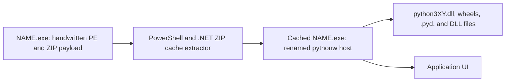

# python-to-binary detailed guide

`python-to-binary` (`py2bin`) is a standard-library-only toolchain with three
separate jobs:

1. Translate a supported Python subset into portable C source.
2. Translate a smaller static Python subset directly into ELF, PE, or Mach-O
   machine-code files without an assembler or linker.
3. Bundle full CPython applications, package data, native extensions, and an
   optional embedded interpreter when source-level native compilation is not
   compatible with the program.

These modes are intentionally distinct. A dynamic application importing Manim,
PyTorch, Transformers, Blender `bpy`, or pywebview cannot truthfully be
converted into one architecture-independent native executable merely by
rewriting its Python files.

## Installation

From PyPI:

```sh
python3 -m pip install python-to-binary
```

Directly from GitHub:

```sh
python3 -m pip install \
  "git+https://github.com/yu314-coder/python_to_binary.git"
```

From a clone without installing:

```sh
git clone https://github.com/yu314-coder/python_to_binary.git
cd python_to_binary
PYTHONPATH=src python3 -m py2bin --help
```

Python 3.10 or newer is required on the build host. Native compilation itself
does not invoke a C compiler, assembler, linker, target SDK, Docker, or target
Python runtime.

The py2bin package has empty build and runtime dependency lists and imports
only Python standard-library modules. It does not use Cython, Nuitka, mypyc,
Rust, C, C++, PyInstaller, or PPCI. This statement describes py2bin itself,
not third-party payloads: a bundled `bpy`, Torch, or NumPy wheel contains that
project's own native implementation and still runs through embedded CPython.

## Choosing an output strategy

| Program | Recommended command | Target Python required |
|---|---|---:|
| Static constants, printing, integer exit | `compile` | No |
| Supported typed Python subset | `emit-c` | C source only |
| Ordinary pure-Python project | `build` or `freeze` | `build`: yes; `freeze`: no |
| pywebview/Manim/Torch/Transformers/bpy | `freeze` | No, but native libraries remain target-specific |

`freeze` and compatible `assemble` builds are self-extracting one-file outputs
by default. Use `--onedir` only when an inspectable runtime directory is more
useful than one-file distribution.

Use `plan-c` before assuming C translation is safe:

```sh
py2bin plan-c app.py
```

It returns `c-source` for the implemented C subset and `cpython-bundle` when
imports or unsupported Python semantics require compatibility mode.

Use `capabilities` for the stricter machine-code question:

```sh
# Stable claim matrix for common packages.
py2bin capabilities

# Inspect imports and the first native-subset rejection without executing code.
py2bin capabilities app.py
py2bin capabilities app.py --json

# Suitable for a check that must fail when compile cannot be used.
py2bin capabilities app.py --strict
```

The command reports `native AOT: no` for NumPy, SciPy, pandas, scikit-learn,
Torch, TorchVision, TensorFlow, JAX, Transformers, Tokenizers, Manim,
Matplotlib, Pillow, OpenCV, `bpy`, pywebview, Gradio, Streamlit, Numba,
llvmlite, Requests, Flask, Django, and FastAPI. This is not a packaging
allowlist. It is a claim matrix explaining that these projects are not
translated by the current `compile` frontend. Their `freeze` status is
conditional on compatible CPython, target wheels/native files, package data,
external tools, drivers, and system services as applicable.

### Exact direct-native subset

The current native frontend combines static output with a small integer
runtime:

- literals, one-name assignments, constant Boolean/conditional expressions,
  and simple static f-strings are accepted;
- runtime integer variables use signed 64-bit native stack slots; `+`, `-`,
  `*`, bitwise operations, constant-count shifts, and signed comparisons emit
  x86-64 or ARM64 instructions;
- constant `if` selects one branch at build time;
- integer `if`, `while`, `for NAME in range(...)`, `break`, and `continue`
  emit native labels and branches; range step is a nonzero integer constant;
- `print` emits constant UTF-8 output using the target OS syscall/API;
- `SystemExit(integer-expression)` and the restricted
  `import sys; sys.exit(integer-expression)` form emit a native process exit;
- runtime arguments/input, dynamic integer-to-text printing, Python arbitrary
  precision integers, division/modulo, functions, mutable containers, classes,
  general exceptions, dynamic calls, and library imports are rejected.

The signed integer runtime wraps overflow to 64 bits; it does not silently
claim Python's arbitrary-precision integer semantics. The resulting
ELF/PE/Mach-O contains real CPU instructions and no CPython, but broad Python
semantics have not yet been implemented.

## Source-only versus compatible bundling

The source-only contract applies only to the documented direct native subset.
Given Python 3.10+, py2bin, and a supported source file, `compile` can write PE,
ELF, or Mach-O on any build host. It does not use Wine, Rosetta, an assembler,
a linker, or a target SDK.

Arbitrary applications are different. Their source does not contain CPython or
the implementations of packages named by import statements. `freeze` therefore
needs a compatible CPython runtime and the actual target package files. Native
extensions must already match the destination OS, architecture, and Python
ABI; py2bin does not rewrite one platform's wheel into another platform's
wheel.

`manim_app` is a concrete example. Its repository imports pywebview but does
not vendor pywebview, and its setup path installs Manim and other tools into a
separate environment. The current py2bin native subset cannot compile that
dynamic program from source alone. A working Windows package needs Windows
CPython, pywebview's Windows components, and all other required package/native
files. Without those inputs, py2bin must report an unsupported or missing-input
error rather than label a non-working PE file as a successful build.

## Cython, wheels, and handwritten machine code

The supported Cython integration point is a prebuilt extension:

```text
owned .py/.pyx module
    -> Cython-generated C
    -> target C compiler/linker
    -> target .pyd/.so
    -> py2bin wheel
    -> py2bin freeze with matching CPython runtime
```

`py2bin wheel` implements the final wheel-packaging stage without setuptools,
pip, `wheel`, or another Python dependency:

```sh
py2bin wheel staged/site-packages -o dist/wheels \
  --name accelerated-app --version 1.0 \
  --python-tag cp311 --abi-tag cp311 --platform-tag win_amd64 \
  --requires "numpy>=2"
```

The builder writes normalized wheel paths, core metadata, compatibility tags,
top-level import metadata, and SHA-256 `RECORD` entries. It skips bytecode
caches and refuses to label `.pyd`, `.so`, `.dylib`, or `.dll` payloads as
`py3-none-any`. Supplied native files are not modified.

The resulting wheel can be passed to `freeze --wheel`. The wheel tag must match
the runtime pack's CPython version, OS, and architecture, and every
unconditional dependency must also be supplied in the target wheel closure.

This is compatible bundling, not direct AOT. Cython translates Python-like
source to C and normally relies on CPython APIs. Replacing its C compiler and
linker with py2bin would require py2bin to parse arbitrary generated C,
preprocess CPython headers, generate every required target instruction and
relocation, implement shared-library/object formats, and satisfy the CPython
extension ABI. That full compiler is not implemented. The current direct
backend handwrites machine code only for its documented Python integer/static
output subset.

## Locked Git/HTTPS sources

An import name is not a secure source locator. For example, the name imported
by Python can differ from the distribution and repository names, and an
unpinned repository branch can change between builds. py2bin therefore
requires a source lock instead of searching GitHub and trusting the first
result.

```json
{
  "schema": 1,
  "sources": {
    "demo": {
      "url": "https://github.com/owner/demo/archive/FULL_COMMIT.tar.gz",
      "revision": "FULL_COMMIT",
      "sha256": "ARCHIVE_SHA256",
      "subdirectory": "src"
    }
  }
}
```

`path` may replace `url` for an offline archive stored beside the lock.
Exactly one of `url` or `path` is required.

Fetch without compiling:

```sh
py2bin fetch-sources app.py \
  --source-root . \
  --source-lock py2bin-sources.lock.json \
  --source-cache /Volumes/D/py2bin-source-cache \
  --json
```

Fetch and use only the direct native compiler:

```sh
py2bin compile app.py -o dist/app \
  --source-root . \
  --source-lock py2bin-sources.lock.json \
  --source-cache /Volumes/D/py2bin-source-cache \
  --target linux-x86_64
```

`compile-source` is an explicit alias-style workflow with the same locked
source behavior. Neither command falls back to `freeze`.

The resolver parses imports recursively without importing modules. Archives
are limited and extracted member-by-member. Absolute/traversal paths, symbolic
or hard links, device/special files, duplicate or case-colliding paths, hash
mismatches, tampered cache trees, non-HTTPS remote URLs, and credential-bearing
URLs are rejected. Downloaded setup/build scripts are data and are never
executed.

Current native linking across a downloaded package is limited to absolute
`from MODULE import NAME` exports that are compile-time constants. This proves
the complete acquisition-to-machine-code path without overstating general
package support. A dynamic library is still rejected even when its repository
was downloaded successfully: possessing source does not implement its language
frontend, runtime semantics, C ABI, native dependencies, or external services.

## Native target selection

The implemented target matrix is:

| OS selector | Architecture selector | Canonical target | File format |
|---|---|---|---|
| `linux` | `x86_64`, `x64`, `amd64` | `linux-x86_64` | ELF64 |
| `linux` | `arm64`, `aarch64` | `linux-arm64` | ELF64 |
| `windows` | `x86_64`, `x64`, `amd64` | `windows-x86_64` | PE32+ |
| `windows` | `arm64`, `aarch64` | `windows-arm64` | PE32+ |
| `macos`, `mac`, `darwin`, `osx` | `x86_64`, `x64`, `amd64` | `darwin-x86_64` | Mach-O |
| `macos`, `mac`, `darwin`, `osx` | `arm64`, `aarch64` | `darwin-arm64` | Mach-O |

Examples:

```sh
py2bin compile hello.py -o dist/hello-linux \
  --os linux --arch x86_64 --clean

py2bin compile hello.py -o dist/hello-arm64.exe \
  --os windows --arch arm64 --clean

py2bin compile hello.py -o dist/hello-mac \
  --os macos --arch arm64 --clean
```

The equivalent exact form is:

```sh
py2bin compile hello.py -o dist/hello.exe \
  --target windows-x86_64 --clean
```

Generate all six native formats:

```sh
py2bin compile-all hello.py -o dist/all --clean
```

Generate one selected format through `compile-all`:

```sh
py2bin compile-all hello.py -o dist/windows-arm \
  --os windows --arch arm64 --clean
```

Native files are target-specific. An ARM64 PE file does not run on Linux ARM64,
and an x86-64 Mach-O does not run on Windows x86-64.

## Native Python subset

The current direct-machine-code frontend supports:

- module docstrings;
- constant assignments;
- constant arithmetic, Boolean expressions, comparisons, conditional
  expressions, constant `if` branches, and basic f-strings;
- `print(...)`;
- `SystemExit(...)` and `sys.exit(...)`.

Unsupported dynamic statements fail with a file, line, and column. The compiler
does not silently produce a program with different semantics.

```python
name = "native"
answer = 6 * 7
print(f"{name}: {answer}")
raise SystemExit(0)
```

## Python-to-C

```sh
py2bin emit-c program.py -o dist/program.c --clean
py2bin emit-c program.py -o dist/program.py2cbin --container --clean
```

The C frontend supports variables, numeric operations, comparisons, Boolean
expressions, branches, loops, `range`, functions, returns, printing, and simple
f-strings. A `.py2cbin` is a versioned and checksummed C-source container, not
an executable.

Turning emitted C into machine code normally requires an explicitly chosen C
compiler. `py2bin compile` is the no-compiler path for its smaller native
subset.

## Full application freezing

Freeze an application and its current compatible CPython runtime into one
self-extracting `.bin` by default:

```sh
py2bin freeze app.py --source-root . -o dist/App \
  --include webview --compact --clean

# Output on macOS/Linux: dist/App.bin
```

For Windows cross-packaging, supply a matching runtime pack, the complete wheel
closure, and optionally an ICO:

```sh
py2bin freeze app.py --source-root . -o dist/App \
  --target windows-x86_64 \
  --runtime-pack runtimes/windows-cp311-amd64 \
  --wheel-dir wheels/windows-cp311 --icon icon.ico --app --compact --clean

# Output: dist/App.exe
```

### Windows process and identity model

On Windows, add `--app` for a windowed PE executable; omit it for a console
program. Both the distributed launcher and the renamed inner `pythonw.exe`
host use the GUI subsystem.



The extractor is used for cache checking as well as first-run extraction. An
unpacked `--onedir` build starts the inner host directly and bypasses the first
two one-file stages.

The isolated `_pth` file names the runtime's versioned standard-library ZIP.
Both the renamed executable's `_pth` file and CPython's versioned-DLL `_pth`
file are updated; otherwise the DLL-level file can prevent `sitecustomize`
from starting the app.

For `--app`, py2bin replaces inherited Python icon/version resources on both
the outer one-file PE and the embedded app host. `--name` becomes the
file/product description and `--icon` supplies both executable icons. Before
the entry script creates its UI, the bootstrap sets a stable
`PythonToBinary.NAME` AppUserModelID for Windows taskbar grouping. The ctypes
call declares the documented `PCWSTR` argument and `HRESULT` return types.
Microsoft requires this process-level identity to be assigned during startup
before UI is presented; see
[Application User Model IDs](https://learn.microsoft.com/en-us/windows/win32/shell/appids)
and
[`SetCurrentProcessExplicitAppUserModelID`](https://learn.microsoft.com/en-us/windows/win32/api/shobjidl_core/nf-shobjidl_core-setcurrentprocessexplicitappusermodelid).

If no `--icon` is supplied, Python's icon is removed and Windows uses its
normal fallback. An application or GUI toolkit can set a different window
icon. An existing pinned shortcut can also carry its own icon and
AppUserModelID, so it should be unpinned and re-pinned when validating a
rebuilt executable. py2bin does not modify existing `.lnk` files.

This changes Windows presentation and grouping only. The running app host
still loads `python3XY.dll`; diagnostic tools can correctly show that module.
The compatible path is not whole-program native AOT code.

Startup work is kept out of the Python layer where practical:

- the handwritten outer PE passes its Unicode path and original command line
  through the child environment, avoiding WMI/CIM process queries;
- the content-addressed cache prevents repeated payload extraction;
- the generated bootstrap embeds the entrypoint and taskbar ID rather than
  reading and parsing the JSON manifest at startup;
- `json` and `pathlib` are absent from the bootstrap path, and `traceback` is
  imported only after an application exception;
- ZIP compression level 6 balances one-file size and extraction cost;
- `--onedir` remains the fastest option for very large native packages because
  it performs no one-file extraction or PowerShell startup.

For the fastest startup, keep a Windows GUI bundle unpacked:

```sh
py2bin freeze app.py --source-root . -o dist/App \
  --target windows-x86_64 \
  --runtime-pack runtimes/windows-cp311-amd64 \
  --wheel-dir wheels/windows-cp311 --app --onedir --compact --clean

# Launch dist/App/App.exe and ship the entire dist/App directory.
```

This path uses the runtime pack's `pythonw.exe` and performs no extraction at
startup. One-file mode instead optimizes distribution and repeat launches: the
first run extracts to a content-addressed cache and subsequent runs reuse it.
Native extension modules and DLLs cannot be imported directly from a ZIP, so a
large Torch or `bpy` payload cannot have a zero-extraction first launch.

On macOS, create a native `.app` entrypoint and convert an ICO to ICNS:

```sh
py2bin freeze app.py --source-root . -o dist/App \
  --app --name App --icon icon.ico \
  --include webview --compact --clean
```

The macOS `Contents/MacOS/App` entry is real handwritten Mach-O machine code
carrying the compressed runtime payload. It forwards command-line arguments,
extracts to a content-addressed cache, and starts the embedded runtime. py2bin
also writes the ad-hoc signature, `Info.plist`, ICNS, and resource seal in
Python. The application logic still runs on embedded CPython for compatibility.

Apple defines `.app` as a directory, so it cannot literally be one filesystem
file. The default app layout contains the payload-bearing executable plus the
mandatory metadata/signature files and optional icon; it does not leave the
runtime unpacked under `Contents/Resources`. Use `--onedir` to retain the older
inspectable payload layout.

For non-app outputs, `--onedir` disables self-extraction:

```sh
py2bin freeze app.py --source-root . -o dist/App --onedir --clean
```

`--compact` removes distribution test suites, bytecode caches, and CPython
build/demo modules. Do not use it when the application intentionally imports
`unittest`, `tkinter`, `lib2to3`, package tests, or CPython build configuration
files.

## Dependencies and native libraries

Static imports are discovered without executing the application.

```sh
py2bin analyze app.py --source-root .
py2bin freeze app.py --source-root . -o dist/App \
  --include dynamically_loaded_plugin
```

Dependency modes:

- `closure`: direct packages plus installed dependency closure;
- `imported`: direct distributions only;
- `none`: project files only.

Native extensions must match the destination OS, CPU, and Python ABI. Build a
Windows bundle from a Windows runtime, a Linux bundle from Linux, and a macOS
bundle from macOS. A build host may assemble another target only when given a
complete matching runtime pack and wheel closure; py2bin packages those native
extensions but does not cross-compile or translate them.

Framework-specific requirements remain external when the framework itself
requires them:

- Manim may require ffmpeg, LaTeX, fonts, and platform libraries.
- Torch GPU builds require compatible drivers and accelerator libraries.
- Transformers model weights must be bundled or available in an offline cache.
- `bpy` requires a compatible Blender/Python build and Blender resources.
- pywebview requires the target platform's webview backend.

## Python API

```python
from pathlib import Path
from py2bin.native import compile_native, resolve_target

target = resolve_target("windows", "arm64")
result = compile_native(
    Path("hello.py"),
    Path("dist/hello.exe"),
    target=target,
    clean=True,
)
print(result.artifact, result.target, result.bytes)
```

Portable C:

```python
from py2bin import compile_to_c, plan_c

source = "print('hello')\n"
print(plan_c(source))
print(compile_to_c(source))
```

Default one-file compatibility build:

```python
from pathlib import Path
from py2bin import freeze

result = freeze(
    Path("app.py"),
    Path("dist/App"),
    source_root=Path("."),
    compact=True,
    clean=True,
)
print(result.bundle, result.onefile)  # dist/App.bin, True
```

Pass `onefile=False` for the unpacked directory layout. Cross-target calls also
pass `runtime_pack=...`, `target=...`, and the complete target `wheels=(...)`.

## ManimStudio reference test

The repository has been validated against `yu314-coder/manim_app` as a large
reference application:

- application source and local modules copied;
- Monaco, HTML, JavaScript, prompts, fonts, and other resources preserved;
- pywebview and PyObjC dependency closure bundled;
- ICO converted to multi-resolution ICNS;
- native ARM64 Mach-O launcher generated;
- command-line arguments preserved;
- embedded CPython runtime loaded instead of the build-host runtime;
- strict macOS signature and resource verification passed.

The reference source is Windows-first and calls `cmd.exe` and `where`, so those
features remain Windows-specific. py2bin does not rewrite application behavior
to conceal platform assumptions.

The Windows reference bundle supplies `pywinpty` rather than excluding the
optional `winpty` import. Validation checks that the bundle contains the
CPython/architecture-specific `_winpty.pyd` plus `conpty.dll`, `winpty.dll`,
`winpty-agent.exe`, and `OpenConsole.exe`. This proves that the native payload
was packaged; functional ConPTY behavior still requires a real supported
Windows test.

## Validation

Run the complete suite:

```sh
PYTHONPATH=src python3 -m unittest discover -s tests -v
```

Inspect targets:

```sh
py2bin targets
```

Validate a rebuilt Windows GUI bundle on real Windows without installing an
inspection tool:

```powershell
$outer = Get-Item .\App.exe
$outer.VersionInfo |
  Select-Object FileDescription, ProductName, OriginalFilename

Start-Process .\App.exe

$inner = Get-ChildItem "$env:LOCALAPPDATA\py2bin" -Filter App.exe -Recurse |
  Sort-Object LastWriteTime -Descending |
  Select-Object -First 1
$inner.VersionInfo |
  Select-Object FileDescription, ProductName, OriginalFilename
```

For an `--app --icon icon.ico` build, both records should identify `App` rather
than Python and Explorer should show the supplied icon. Also confirm:

1. no console window appears;
2. the application UI opens;
3. the taskbar button uses the application icon;
4. an old pinned shortcut has been unpinned and the rebuilt executable pinned
   again;
5. Task Manager shows the app-named executable, while loaded-module inspection
   may still correctly show `python3XY.dll`;
6. first-run and cached-run behavior both work; compare `--onedir` separately
   when startup time is the priority.

The automated suite structurally checks PE architecture, GUI subsystem,
outer/inner icon groups, version strings, manifest preservation, bootstrap API
signature, and the absence of inherited Python version identity. Those checks
do not replace a real Windows UI test.

For generated files, test on the actual destination operating system and CPU.
Wine is useful for some PE checks but is not equivalent to real Windows
certification.

## Publishing and release integrity

Build wheel and source distribution:

```sh
python3 -m build
python3 -m twine check dist/*
```

The repository preserves example GitHub Actions definitions under
`.github/workflows-disabled/`. GitHub does not discover workflows there, and
`.github/workflows/` is intentionally empty. Normal pushes, pull requests,
manual dispatches, and releases therefore do not start GitHub Actions. The
repository-level Actions permission is also disabled as a second guard.
Moving a definition back under `.github/workflows/` or changing the repository
permission is an explicit re-enable action and requires the owner's direction.
Publishing to PyPI requires either a configured PyPI trusted publisher or a
valid API token. Never commit tokens or `.pypirc`.

Before a release:

1. Run all tests.
2. Verify all six generated headers.
3. Build and inspect both wheel and source distribution.
4. Install the wheel into an empty virtual environment.
5. Run `py2bin targets` and compile a smoke-test source.
6. Tag the exact commit intended for release.

## Current limitations

- Direct native compilation implements a deliberately narrow Python subset.
- Source plus py2bin alone cannot reproduce missing third-party packages or a
  complete CPython runtime for dynamic applications such as `manim_app`.
- Full-library freeze outputs are specific to their runtime pack's platform,
  architecture, Python ABI, and native dependency closure.
- Windows and Linux frozen-runtime packs are not yet cross-produced from
  macOS.
- The macOS frozen-app native launcher is currently implemented for ARM64;
  x86-64 remains available for narrow native Mach-O output.
- Driver, license, model, font, ffmpeg, LaTeX, and system-service requirements
  cannot be removed by changing executable formats.
- One-file compatibility outputs extract before execution. Windows uses the
  base Windows PowerShell/.NET ZIP facilities; Linux and macOS use base
  `/bin/sh`, `tail`, `head`, and `tar`. Minimal systems without those tools
  require `--onedir`.
